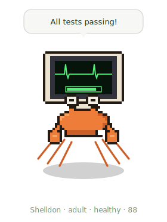

# FitPet 🌱

[](https://github.com/victory-c/fitpet/actions/workflows/ci.yml)

A **desktop pixel companion** that **grows from your real-world fitness** (via Garmin) and
**reacts to your coding** in real time — a spiritual revival of Claude Code's old `/buddy`. It's
a small frameless, transparent, always-on-top window you place over your editor: a pixel
creature that thrives when you train, wilts when you rest, and pops a speech bubble when your
tests pass or an error hits.

<p align="center">
  
</p>

> Honest note: this is an **independent** window you position next to / over Claude Code — it
> reproduces the *feel* of `/buddy`, not its in-app slot (that's Anthropic's).

## Two independent axes

- **Care axis ← fitness.** Your Garmin training load over a rolling 7-day window sets the pet's
  vitality → **species, tier** (thriving / healthy / wilting / dormant) and **evolution stage**
  (egg → hatchling → juvenile → adult). It never dies — it goes dormant and a workout revives it.
- **Reaction axis ← coding.** Claude Code hooks fire short, pre-written quips on events (tests
  pass/fail, errors, edits, session start) — shown as a **speech bubble** plus a **bounce/shake**
  animation. Chosen locally, **no model calls**.
- **Sport layer.** The pet's **idle animation** matches your latest activity — a cycling rock, a
  running bounce, a swimming sway.

The pet **grows from your workouts** but **reacts to your code**, and the two never affect each other.

## Why the hooks matter

The window runs **outside** Claude Code, so it can't see your coding events itself. Claude Code
hooks (`SessionStart`, `Stop`, `PostToolUse`, `PostToolUseFailure`) are the **bridge**: they
detect events and write reactions into `~/.fitpet/state.json`, which the window watches and shows.

## Requirements

- **Node.js ≥ 23.6** (the engine, CLI, and hooks run TypeScript directly — no build step).
- The desktop window uses **Electron** (installed via `npm install`).
- **Garmin MCP** connected in Claude Code — that's how fitness data reaches the pet.

## Quick start

```bash
git clone <this repo> ~/fitpet && cd ~/fitpet
npm install                              # deps + the Electron binary

node src/cli.ts reset --name Sprout      # hatch a pet (try --species pixelcat|slime)
npm run app:dev                          # open the companion window

node src/cli.ts install                  # add the coding-event hooks to ~/.claude/settings.json
# → restart Claude Code so the hooks load
```

`install` is safe: it **backs up** your `settings.json`, **merges** (never clobbers existing
keys), and **aborts** rather than overwrite an unparseable file. Preview with
`node src/cli.ts install --print`; undo with `node src/cli.ts uninstall`.

> If `npm run app:dev` fails with `Error: Electron uninstall`, the Electron binary didn't
> download. Fix it with `node node_modules/electron/install.js`, then retry.

## How growth works

A hook can't call an MCP tool, so fitness data is pulled by a model-run sync:

- **Automatic-ish:** when the pet's data is stale (> 8h), a `SessionStart` hook nudges Claude to
  run the sync at the start of a session.
- **Manual:** run the **`/fitpet-sync`** skill any time — it reads your recent Garmin activity +
  training load and feeds the pet.

Decay is **data-driven**: the pet only wilts when a sync shows you actually trained less — never
because you forgot to sync.

## Commands

| Command | What it does |
| --- | --- |
| `npm run app:dev` | Launch the companion window (dev) |
| `fitpet status` | Print the pet as text (debug; the window is the real face) |
| `fitpet feed <minutes>` | Hand-feed a synthetic workout (for testing) |
| `fitpet sync --source garmin --file <json>` | Apply Garmin MCP data (the `/fitpet-sync` skill does this) |
| `fitpet react <event>` | Force a quip (`test_pass`, `error`, …) — pops the bubble |
| `fitpet reset [--name --species --personality]` | Start a fresh pet |
| `fitpet install [--print --repair]` / `uninstall` / `doctor` | Manage the Claude Code hooks |

(Run via `node src/cli.ts <command>` unless you've linked the `fitpet` bin.) The window and the
CLI/hooks share `~/.fitpet` — set `FITPET_HOME` on both to use a throwaway pet for testing.

## How it's built

Four decoupled pieces share one local file, `~/.fitpet/state.json`, and never call each other:

1. **The window** — [`src/desktop/`](src/desktop): an Electron app. `main.ts` reuses the engine
   and watches state; `renderer/` draws the pixel sprite, speech bubble, and animations.
2. **The heartbeat + reactions** — [`src/hooks/`](src/hooks): the coding-event bridge.
3. **The feeder** — the [`/fitpet-sync`](skills/fitpet-sync/SKILL.md) skill + `fitpet sync` (Garmin).
4. **The content** — [`src/content/`](src/content): species, personalities, and the quip library.

All the rules live in pure, unit-tested functions ([`src/vitality.ts`](src/vitality.ts),
[`src/engine.ts`](src/engine.ts)). The sprites are **original programmatic pixel art** —
editable text grids in [`src/desktop/renderer/sprites/`](src/desktop/renderer/sprites) (a
character per pixel). Run the tests with `npm test`, types with `npm run typecheck`, and build
the app with `npm run app:build`.

## Tuning

Sim balance lives in [`src/config.ts`](src/config.ts): tier cutoffs, ease rate, evolution
requirements, sport-intensity factors, and `GARMIN_LOAD_GOAL`. Animation timings live in the
window's [`index.html`](src/desktop/renderer/index.html).

## Roadmap

- Per-stage and additional-species sprite art (the vertical slice ships Sprout fully).
- **Optional model-generated speech bubbles** (the original `/buddy` used live commentary) — V1
  stays templated/local; this would be opt-in.
- **Background growth without a session:** an HTTP/OAuth source (e.g. **WHOOP**) polled by a
  cron, so the pet grows with no model involvement. The feeder is a one-file adapter
  ([`src/sources/`](src/sources)).
- Packaging the window as a standalone app (electron-builder) with launch-at-login.

## Privacy

Single-player and fully local. FitPet's scoring and storage are plain arithmetic on **your own**
data, kept on your machine — **nothing is sent to any third party or used for training.**

One honest caveat: to read Garmin, the `/fitpet-sync` skill has **the model** call the Garmin MCP,
so your activity data passes through the model's session (as it must, to be fetched). The payload
is handed to FitPet via a temp file, never via command-line args. A truly model-free path (the
WHOOP background adapter above) is on the roadmap.

## License

MIT — see [LICENSE](LICENSE).
