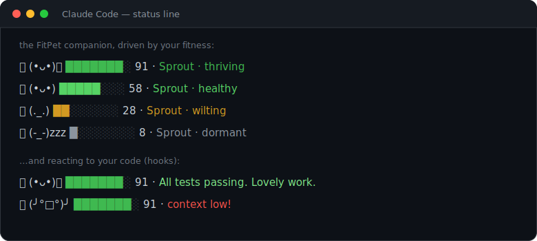

# FitPet 🌱

[](https://github.com/victory-c/fitpet/actions/workflows/ci.yml)

A companion that lives in your **Claude Code status line**. It **grows from your real-world
fitness** (via Garmin) and **reacts to your coding** in real time — a spiritual revival of
Claude Code's old `/buddy`, but kept alive by your workouts instead of your keystrokes.

<p align="center">
  
</p>

```
🌱 (•ᴗ•)🌿 ███████░ 87 · All tests passing. Lovely work.
```

## Two independent axes

- **Care axis ← fitness.** Your Garmin training load over a rolling 7-day window sets the pet's
  vitality. Train and it thrives and evolves; rest too long and it wilts (it never dies — it goes
  dormant and a workout revives it).
- **Reaction axis ← coding.** Claude Code hooks fire short, in-character quips when you do things:
  tests pass, an error happens, you edit a file, a new session starts. These are pre-written and
  chosen locally — **no model calls, nothing leaves your machine.**

The pet **grows from your workouts** but **reacts to your code**. The two never affect each other.

## Requirements

- Node.js ≥ 23.6 (this project uses Node's native TypeScript support — no build step needed).
- Claude Code, with the **Garmin MCP** connected (that's how fitness data reaches the pet).

## Install

```bash
git clone <this repo> ~/fitpet && cd ~/fitpet
node src/cli.ts reset --name Sprout      # hatch a pet (try --species pixelcat|slime)
node src/cli.ts install                  # add the status line + hooks to ~/.claude/settings.json
# → restart Claude Code
```

`install` is safe: it **backs up** your `settings.json`, **merges** (never clobbers existing keys),
and will not replace an existing status line unless you pass `--force`. Preview first with
`node src/cli.ts install --print`. Undo any time with `node src/cli.ts uninstall`.

## How growth works

A hook can't call an MCP tool, so fitness data is pulled by a model-run sync:

- **Automatic-ish:** when your pet's data is stale (> 8h), a `SessionStart` hook nudges Claude to
  run the sync at the start of a session.
- **Manual:** run the **`/fitpet-sync`** skill any time. It calls the Garmin MCP for your recent
  activities + training load and feeds the pet.

Decay is **data-driven**: the pet only wilts when a sync shows you actually trained less — *never*
because you forgot to sync.

## Commands

| Command | What it does |
| --- | --- |
| `fitpet status` | Show the pet |
| `fitpet feed <minutes>` | Hand-feed a synthetic workout (for testing) |
| `fitpet sync --source garmin --json '<…>'` | Apply Garmin MCP data (the skill does this for you) |
| `fitpet react <event>` | Force a quip (`test_pass`, `error`, …) |
| `fitpet reset [--name --species --personality]` | Start a fresh pet |
| `fitpet install [--force --print]` / `uninstall` / `doctor` | Manage the Claude Code wiring |

(Run via `node src/cli.ts <command>` unless you've linked the `fitpet` bin.)

## Tuning

Everything tunable lives in [`src/config.ts`](src/config.ts): tier cutoffs, the ease rate,
evolution thresholds, sport-intensity factors, and `GARMIN_LOAD_GOAL` (the weekly training load
that maps to a full score — calibrate this to your own typical week).

## How it's built

Four decoupled pieces share one local file, `~/.fitpet/state.json`, and never call each other:

1. **The face** — [`src/face.ts`](src/face.ts): a pure renderer for the status line. Never blanks.
2. **The heartbeat + reactions** — [`src/hooks/`](src/hooks): advance the sim and write quips.
3. **The feeder** — the [`/fitpet-sync`](skills/fitpet-sync/SKILL.md) skill + `fitpet sync` (Garmin).
4. **The content** — [`src/content/`](src/content): species, personalities, and the quip library.

All the rules live in pure, unit-tested functions ([`src/vitality.ts`](src/vitality.ts),
[`src/engine.ts`](src/engine.ts)). Run the tests with `npm test` (and `npm run typecheck`).

## Roadmap

- **Background growth without a session.** Today growth needs a model-run sync. An OAuth/HTTP source
  (e.g. **WHOOP**, whose `strain` maps directly to our load model) could be polled silently by a
  cron/hook. The feeder is a one-file adapter ([`src/sources/`](src/sources)) so adding one doesn't
  touch the pet.
- Model-generated quips, more species, timezone-aware day counting.

## Privacy

Single-player and fully local. FitPet's scoring and storage are plain arithmetic on **your own**
data, kept on your machine — **nothing is sent to any third party or used for training.**

One honest caveat about the sync flow: to read Garmin, the `/fitpet-sync` skill has **the model
call the Garmin MCP**, so your activity data does pass through the model's session (as it must, to
be fetched). The payload is handed to FitPet via a temp file, never via command-line args or shell
history. A truly model-free path is on the roadmap: an HTTP/OAuth adapter (e.g. **WHOOP**) that a
background job could poll without any model involvement.

## License

MIT — see [LICENSE](LICENSE).
